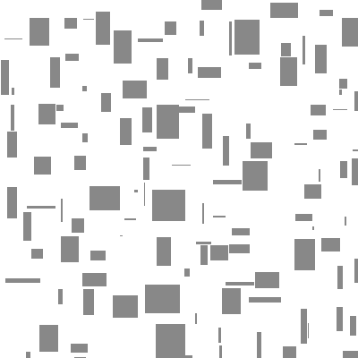
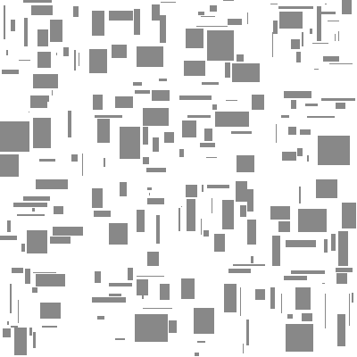
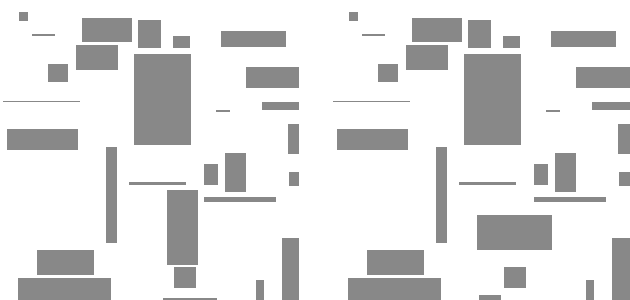

+++
title = "Generating infinite structures"
date = 2020-11-07

[taxonomies]
tags = ["procedural generation"]
+++

If you have ever done anything with procedural generation, you have probably heard of [Perlin noise](https://en.wikipedia.org/wiki/Perlin_noise) (or the a bit more modern [Simplex noise](https://en.wikipedia.org/wiki/Simplex_noise)).
These are very usefull for creating infinite continuous things like landscapes or natural textures.
And by infinite I mean truly infinite, which I categorize by two things:
1. The output is independent of the order in which you generate things
2. You can look at any point in space and compute your output in constant time

It should be obvious that every procedural world should have these properties, but it may be less obvious why this is a hard thing to achieve.
<!-- more -->

### The problem

Take a look at the following example:
You want to fill a space with rectangles that do not overlap. They do not necessarily have to cover the whole space, but there should not be any obvious pattern.
If the space you are filling is finite this is an easy task.
Just randomly place rectangles and remove overlapping ones.

<canvas id="canvas_finite" width="400" height="400"><noscript>
You can run these examples if you turn on javascript
</noscript></canvas>
{{ include_js(path="finite.js") }}

However this method does not naively extend to infinite spaces.
You could divide the world into cells and generate each cell independently with each rectangle lying completely in one cell, but this creates a pretty obvious pattern at the border of the cells.

<canvas id="canvas_naive" width="400" height="400"><noscript></noscript></canvas>
{{ include_js(path="naive.js") }}

Another method might be letting the rectangles overlap the cell borders and testing intersections with every previously generated cell, but this violates rule 1 as you can get different results based on which cell you generate first.

<canvas id="canvas_ordered" width="630" height="300"><noscript></noscript></canvas>
{{ include_js(path="ordered.js") }}

Finally one could solve this problem by defining an order in which the cells get generated (e.g. from the origin outwards). This violates rule 2 as cells that lie far away from the origin would take forever to generate, but it turns out that this approach can be modified to comply with rule 2.

### Approach 1

Instead of having a total ordering one can generate cells in a sort of checkerboard pattern. This means cells get computed in 4 steps (8 for the 3D case).

<pre>
0 1 0 1 0
2 3 2 3 2
0 1 0 1 0
2 3 2 3 2
0 1 0 1 0
</pre>

Each rectangle only needs to check for interesctions with neighbouring cells, which by definition of the pattern are not generated in the same step. As a result of this the output of a cell only depends on a finite ammount of cells to be generated previously and the algorithm runs in constant time.
